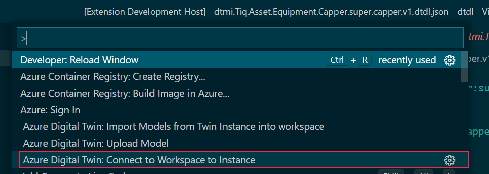
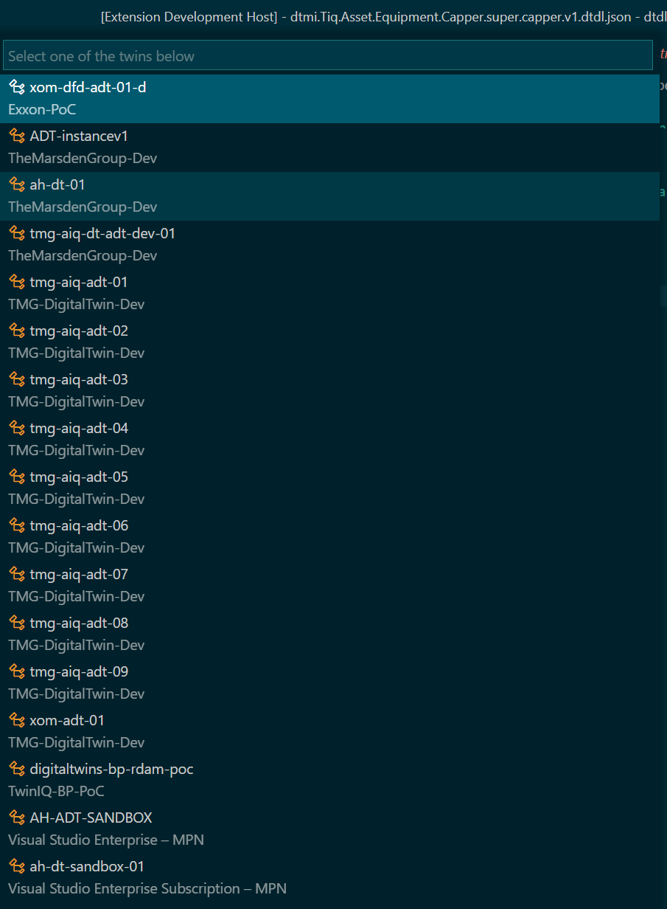
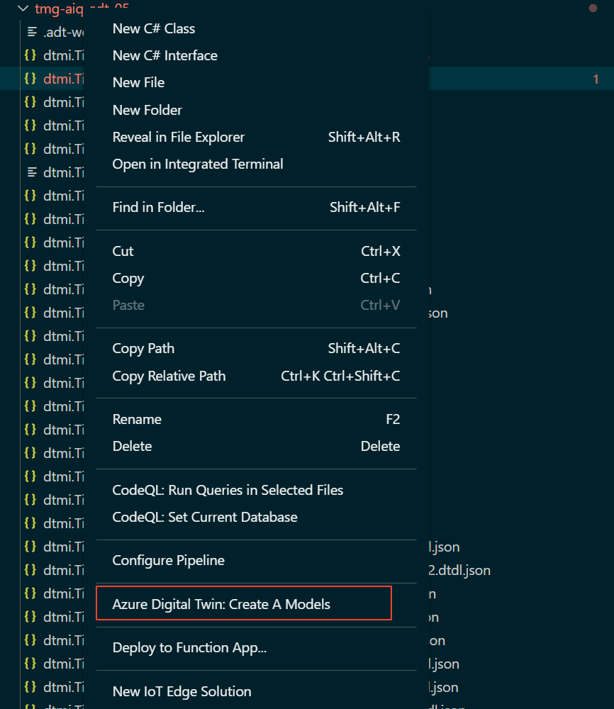
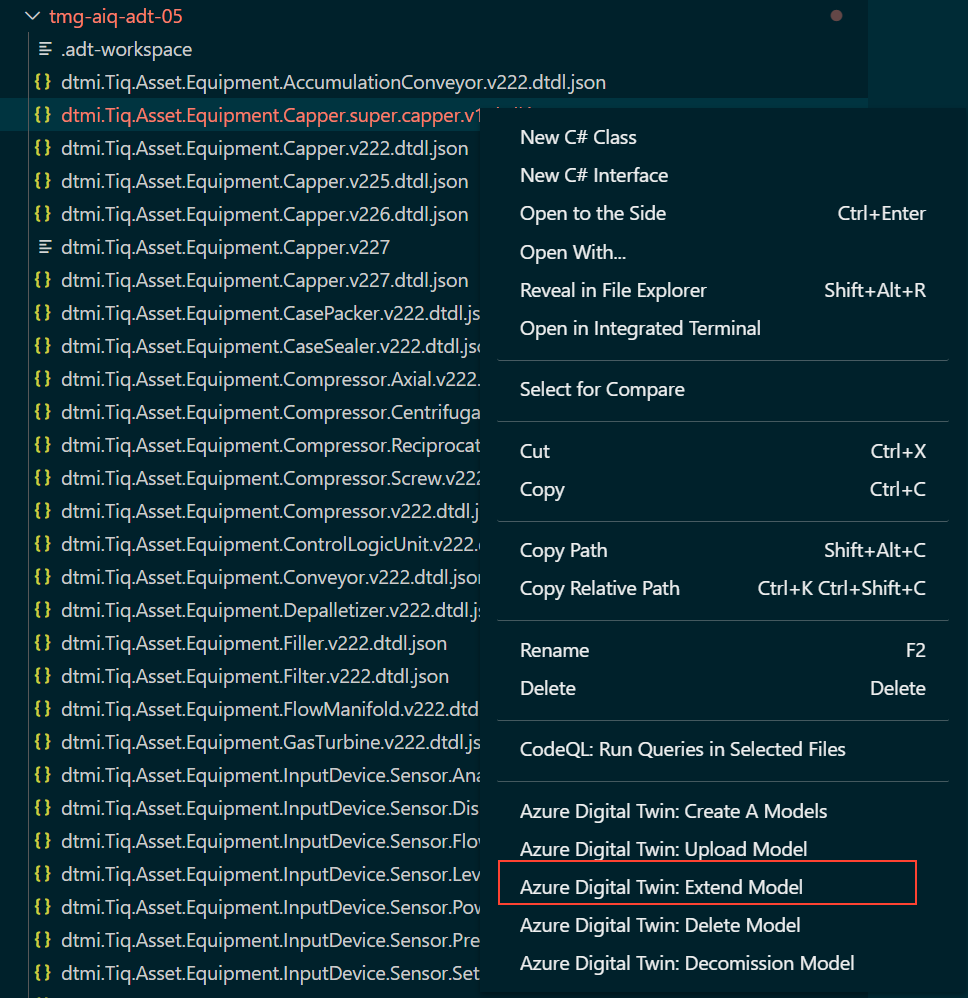
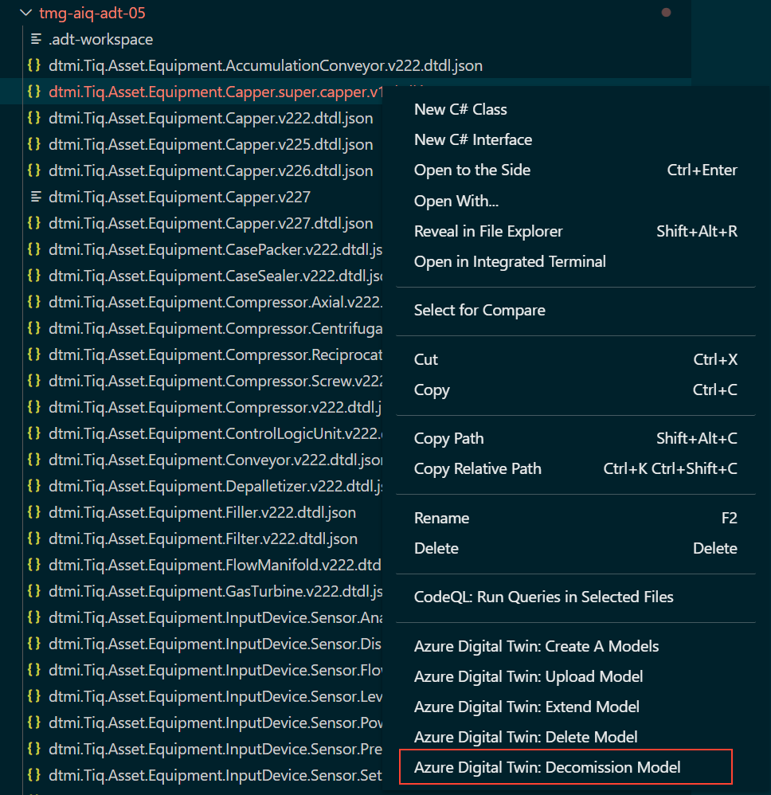

# README

This is the README for "adt-manager". This extension allows users to create adt workspaces enabling the editing of Azure Digital Twin Models

## Getting Started

### 1. Connect to an Azure Digital Twins Instance

    Please Ensure you have run the Azure Signin Command before using this extension.

Press F1 and Select 'Azure Digital Twin: Connect to Workspace to Instance' this will provide you with a list of Azure Digital Twin Instances.

Select one of the instances.

Upon selecting an instance vscode will then download all of the models the instance selected plus a .adt-workspace file which enables vscode to connect in future without going through the selection process.

    if you don't see the Azure Digital Twins Instances you expect, try pressing F1 and selecting "Azure Signin"

### 2. Create A Model

In the Explorer Menu on the left, right click on a directory and select "Create a Model", this will prompt for a model name and a model id. it will then create a dtdl.json file ready for editing.

### 3. Upload A Model

In the Explorer Menu, right click on a Model and select "Upload Model" this will then upload that model to the Twin Instance configured the .adt-workspace file within the same directory.

It will then check to see if the model already exists, if it does it will offer to automatically decomission the existing model and upload the new one incrementing the version number.

### 4. Extend a Model

Right clicking on a model file (.json or .dtdl) and selecting "Extend Model" will provide the user with a set of prompts for a new model name and an id. It will then create the new model file and open it ready for editing.

### 5. Decommission A Model

In the explorer panel on the left, right click on a model file (either a .json or a .dtdl file) and select "Decommission Model" this will decommission the selected model within the Twin Instance.

## Features

There are 6 commands:

- Connect to Azure Digital Twin Instance
- Import Models from Azure Digital Twin Instance
- Upload Model to Azure Digital Twin Instance
- Delete Model in Azure Digital Twin Instance
- Decommission  Model in Digital Twin Instance
- Extend a Model from a Digital Twin Instance
